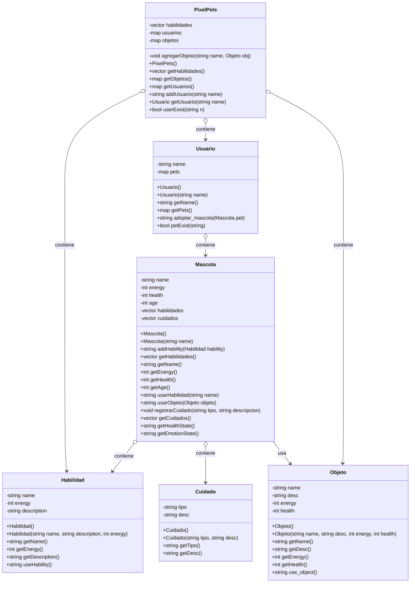

```mermaid
classDiagram
    class PixelPets {
        -vector<Habilidad> habilidades
        -map<string, Usuario> usuarios
        -map<string, Objeto> objetos
        -void agregarObjeto( string name,  Objeto obj)
        +PixelPets()
        +vector<Habilidad> getHabilidades() 
        +map<string, Objeto> getObjetos() 
        +map<string, Usuario> getUsuarios() 
        +string addUsuario( string name)
        +Usuario getUsuario( string name)
        +bool userExist( string n)
    }

    class Mascota {
        -string name
        -int energy
        -int health
        -int age
        -vector<Habilidad> habilidades
        -vector<Cuidado> cuidados
        +Mascota()
        +Mascota(string name)
        +string addHability(Habilidad hability)
        +vector<Habilidad> getHabilidades() 
        +string getName() 
        +int getEnergy() 
        +int getHealth() 
        +int getAge() 
        +string usarHabilidad( string name)
        +string usarObjeto( Objeto objeto)
        +void registrarCuidado( string tipo,  string descripcion)
        +vector<Cuidado> getCuidados() 
        +string getHealthState() 
        +string getEmotionState() 
    }

    class Habilidad {
        -string name
        -int energy
        -string description
        +Habilidad()
        +Habilidad(string name, string description, int energy)
        +string getName() 
        +int getEnergy() 
        +string getDescription() 
        +string useHability() 
    }

    class Cuidado {
        -string tipo
        -string desc
        +Cuidado()
        +Cuidado(string tipo, string desc)
        +string getTipo() 
        +string getDesc() 
    }

    class Objeto {
        -string name
        -string desc
        -int energy
        -int health
        +Objeto()
        +Objeto(string name, string desc, int energy, int health)
        +string getName() 
        +string getDesc() 
        +int getEnergy() 
        +int getHealth() 
        +string use_object() 
    }

    class Usuario {
        -string name
        -map<string, Mascota> pets
        +Usuario()
        +Usuario(string name)
        +string getName() 
        +map<string, Mascota> getPets()
        +string adoptar_mascota( Mascota pet)
        +bool petExist(string) 
    }

    %% Relaciones
    PixelPets o--> Habilidad : contiene
    PixelPets o--> Usuario : contiene
    PixelPets o-->  Objeto : contiene
    Usuario o--> Mascota : contiene
    Mascota o--> Habilidad : contiene
    Mascota o--> Cuidado : contiene
    Mascota --> Objeto : usa
```